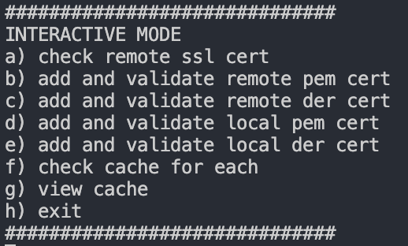

# Dokumentacja

## Wymagane technologie

- Python 3.10+
    - notify-py

## Instalacja

Aby zainstalować i włączyć skrypt sprawdzający ważność
certyfikatów należy wprowadzić poniższą kombinacje komend:

```
pip install -r requirements.txt
```

## Włączenie tryby interaktywnego

- Należy wprowadzić poniższą komendę:
```
python3 main.py -i
```

- Następnie pojawia się panel konsolowy


- Następnie można wybrac interesującą opcję

## Włączenie trybu czuwania

W trybie czuwania, skrypt sprawdza ważność certyfikatów 
co podany okres czasu w sekundach.
```
python3 main.py -c -p <czas-co-ile-nalezy-sprawdzac-waznosc>
```

## Jak podawać nazwy serwerów / ścieżki do plików
- Ścieżki to plików powinno być bezwzględne
- Nazwy serwerów najlepiej podawać w formie ```www.domena.com``` jednak program powinien sobie poradzić
 z ```domena.com```

## --help

W razie niejasności, czy zobaczenia opisu danej flagi należy 
uruchomić skrypt z flagą --help

```
python3 main.py --help
```
